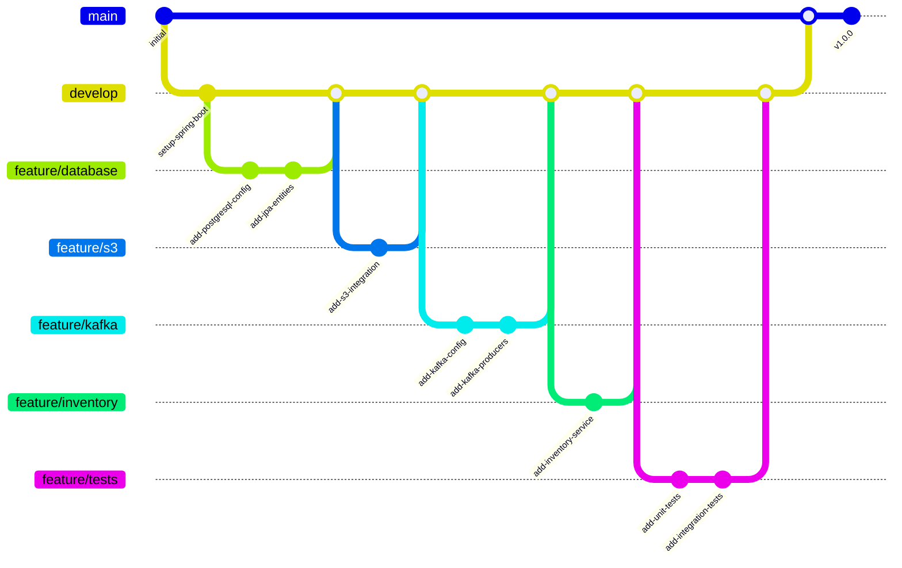

# Catalog Service - Spring Boot Migration

This project is a Java/Spring Boot migration of the Docker Samples Catalog Service, originally written in Node.js. It demonstrates Docker's services integration in a Spring Boot application.

## Architecture

This sample app provides an API with the following architecture:

- Spring Boot backend service
- React frontend
- PostgreSQL database for product data
- AWS S3 (LocalStack) for product images
- Apache Kafka for event streaming
- External inventory service (mocked with WireMock)
- Integration testing with Testcontainers

## Git Workflow



## Project Structure

```
├── src/
│   ├── main/
│   │   ├── java/
│   │   │   └── com/example/catalogservice/
│   │   │       ├── config/         # Configuration classes
│   │   │       ├── controller/     # REST controllers
│   │   │       ├── model/         # JPA entities
│   │   │       ├── repository/    # Spring Data repositories
│   │   │       ├── service/       # Business logic
│   │   │       └── client/        # External service clients
│   │   └── resources/
│   │       └── application.yml    # Application configuration
│   └── test/
│       └── java/                  # Test classes
└── frontend/
    ├── src/
    │   ├── components/           # React components
    │   ├── services/            # API services
    │   └── App.jsx              # Main React component
    └── package.json
```

## Prerequisites

- Java 17 or later
- Docker and Docker Compose
- Maven
- Node.js and npm (for frontend development)

## Getting Started

1. Clone the repository:
   ```bash
   git clone https://github.com/ajeetraina/catalog-service-node-java.git
   cd catalog-service-node-java
   ```

2. Start the infrastructure services:
   ```bash
   docker compose up -d
   ```

3. Build and run the Spring Boot application:
   ```bash
   ./mvnw spring-boot:run
   ```

4. Start the frontend development server:
   ```bash
   cd frontend
   npm install
   npm run dev
   ```

## Available Services

- Backend API: http://localhost:8080
- Frontend: http://localhost:5173
- pgAdmin: http://localhost:5050
  - Email: admin@example.com
  - Password: postgres
- Kafka UI: http://localhost:8080
- LocalStack (S3): http://localhost:4566
- WireMock (Inventory Service): http://localhost:8081

## API Endpoints

### Products API

- GET /api/products - List all products
- GET /api/products/{id} - Get product by ID
- POST /api/products - Create new product
- PUT /api/products/{id} - Update product
- DELETE /api/products/{id} - Delete product

### Example Product Creation

```bash
curl -X POST http://localhost:8080/api/products \
  -H "Content-Type: multipart/form-data" \
  -F "product={\"name\":\"Test Product\",\"price\":99.99}" \
  -F "image=@product.jpg"
```

## Testing

1. Run unit tests:
   ```bash
   ./mvnw test
   ```

2. Run integration tests:
   ```bash
   ./mvnw verify
   ```

3. View test coverage report:
   ```bash
   open target/site/jacoco/index.html
   ```

## Components

### 1. Database Integration
- Uses Spring Data JPA with PostgreSQL
- Automatic schema generation
- Entity lifecycle management
- Transaction management

### 2. S3 Integration
- Uses AWS SDK v2
- LocalStack for local development
- Presigned URLs for secure image access
- Support for image upload and management

### 3. Kafka Integration
- Product update events
- Configurable topics and partitions
- JSON serialization of events

### 4. Inventory Service Integration
- REST client integration
- Circuit breaker pattern
- Fallback mechanisms
- WireMock for testing

### 5. Frontend Features
- React components
- Tailwind CSS styling
- Responsive design
- Real-time updates
- Image upload support

## Development

### Adding New Features

1. Create a new feature branch:
   ```bash
   git checkout -b feature/your-feature
   ```

2. Implement your changes

3. Add tests

4. Create a pull request

### Running Locally with Different Profiles

1. Development profile:
   ```bash
   ./mvnw spring-boot:run -Dspring.profiles.active=dev
   ```

2. Test profile:
   ```bash
   ./mvnw spring-boot:run -Dspring.profiles.active=test
   ```

## Contributing

1. Fork the repository
2. Create your feature branch
3. Commit your changes
4. Push to the branch
5. Create a Pull Request

## License

This project is licensed under the MIT License - see the LICENSE file for details.
